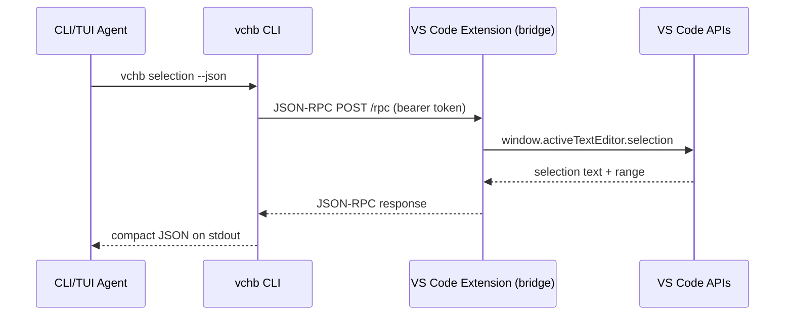

# vscode-cli-harness-bridge

A VS Code extension + CLI (`vchb`) that lets terminal-native agent harnesses use VS Code as an editor-aware tool provider — without replacing the harness's native TUI.

## How it works



The agent stays in its terminal. VS Code provides editor context, diagnostics, diff views, and (later) editor-mediated edits — all over a localhost JSON-RPC bridge.

## Quick start

```bash
# Build everything
npm install && npm run build

# Install the extension
code --install-extension packages/extension/vscode-cli-harness-bridge-0.0.2.vsix

# Reload VS Code, then from a terminal in the workspace:
node packages/cli/dist/index.js sessions          # list bridge sessions
node packages/cli/dist/index.js active-editor --json  # what file is focused
node packages/cli/dist/index.js selection --json      # current selection
node packages/cli/dist/index.js diagnostics --json    # VS Code problems
node packages/cli/dist/index.js diff PLAN.md /tmp/PLAN.proposed.md  # open diff
```

## CLI commands

| Command | Description |
|---------|-------------|
| `vchb sessions` | List discoverable VS Code bridge sessions |
| `vchb active-editor` | Active editor metadata (uri, language, dirty) |
| `vchb selection` | Current selection text + range |
| `vchb diagnostics [path] [--all]` | VS Code problems (active file, specific, or workspace) |
| `vchb diff <original> <proposed> [--title T]` | Open a native VS Code diff view |
| `vchb permission <method> [desc]` | Request permission (allow once/always/deny) |

All commands accept `--json` for machine-readable output and `--workspace <path>` to target a specific VS Code window.

## Architecture

```
packages/
  protocol/    Shared TypeScript types + zod schemas (no deps on vscode/http)
  extension/   VS Code extension — HTTP bridge on 127.0.0.1, bearer auth, dispatcher
  cli/         vchb binary — session discovery, JSON-RPC client, path mapping
```

**Session discovery:** Each VS Code window runs its own bridge on a random port and writes a session file to `~/.vscode-cli-harness-bridge/sessions/<hash>.json`. The CLI matches the terminal's `cwd` to the correct session (resolving git worktrees, multi-root workspaces).

**Security:** Loopback-only bind, per-window random bearer token (`0600` session files), method allowlist, workspace path guarding, permission-gated write methods.

## Environment variables

| Variable | Description |
----------|-------------|
| `VCHB_BRIDGE_URL` | Explicit bridge URL (skips session discovery) |
| `VCHB_BRIDGE_TOKEN` | Explicit bridge token |
| `VCHB_WORKSPACE` | Target workspace root |
| `VCHB_PATH_MAP` | `containerRoot=hostRoot` path mapping override |
| `VCHB_DEBUG` | Set to `1` for debug logging to stderr |
| `VCHB_TIMEOUT_MS` | Request timeout in ms |

## Docker / sandbox

Inside a container (omp-sbx), the CLI auto-detects the environment and prefers the
`dockerBridge` URL from the session file. Proxy bypass is handled automatically. See
`examples/omp-sbx/` for details.

## Examples

- `examples/omp/` — OMP agent integration notes
- `examples/omp-sbx/` — Docker sandbox networking guide
- `examples/generic-agent/` — minimal bash integration example

## Development

```bash
npm install
npm test          # 53 tests (vitest)
npm run typecheck # tsc --noEmit
npm run build     # esbuild bundles for extension + CLI
npm run package:vsix  # produce .vsix
```

## Status

Phases 0–5 complete and HITL-validated. See `PROGRESS-TRACKING.md` for details and `PLAN.md` for the full plan.

## License

MIT
```
